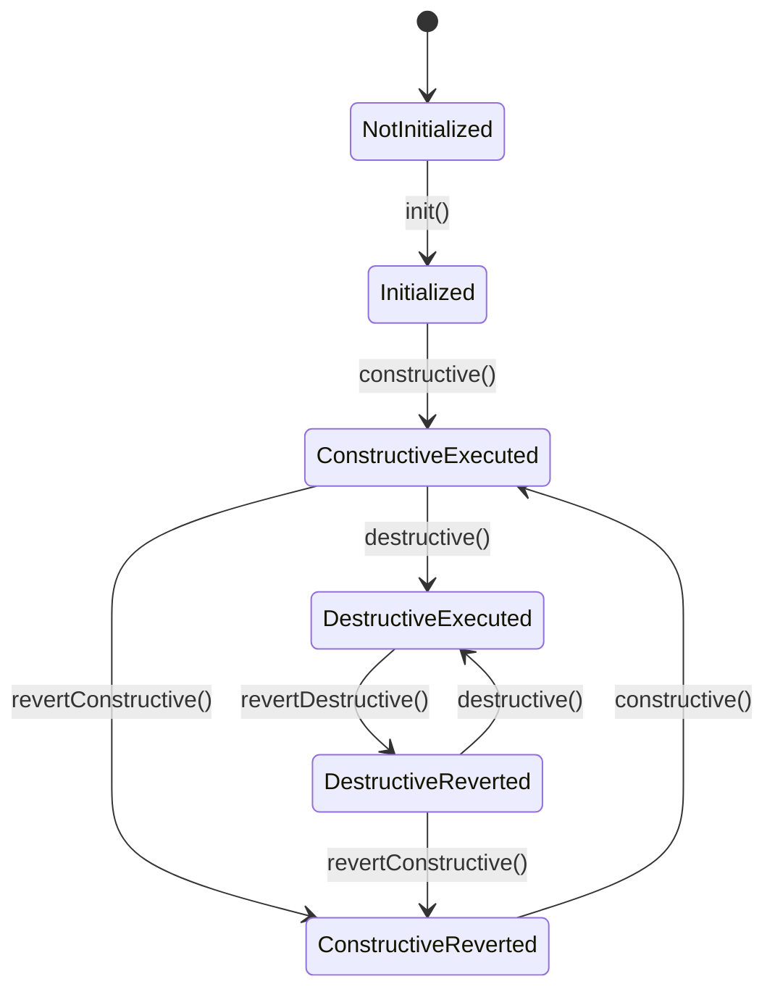

Get your desired schema applied to a database by running migrations. Migrations
are split into two parts: a constructive part and a destructive part. The
constructive part is meant to be run automatically, it should no break any
existing code. When this is done and the new code has been deployed and no old
is live anymore, the destructive part can be run manually.

This makes sure database changes related to each are colocated in the same
migration, but can be run on different times. Replacing one feature for another
would be a great use case.

## Migration class

Migrations are created by creating a class that extends
`Access\Migrations\Migration`. This class has two abstract methods that you
need to override to make the migration functional: `constructive` and
`revertConstructive`.

```php
class SomeMigration extends Migration
{
    public function constructive(SchemaChanges $schemaChanges): void
    {
        $schemaChanges->createTable('users');
    }
    
    public function revertConstructive(SchemaChanges $schemaChanges): void
    {
        $schemaChanges->dropTable('users');
    }
}
```

The `SchemaChanges` argument is used to add changes you the migration will
apply to the database.

## Migrator

Once the migration is created, it needs to be executed. For this, the
`Migrator` class exists. First the table that keep track of which migrations
are already executed needs to be created.

```php
$db = ...;
$migrator = new Migrator($db);
$migrator->init();
```

After the migrator has been initialized, the first migration can be run:

```php
$migration = new SomeMigration();
$result = $migrator->constructive($migration);
```

The `$result` will be a `MigrationResult` that contains a status and the
queries that have been executed.

## Checkpoints

When developing migrations it can be a hassle if one of the queries fails for
one reason or another. The database is in an inconsistent state and running a
migration again might no be possible because one of the queries in the
migration _did_ succeed. By using a checkpoint when running a migration it is
possible to skip some steps of a migration. A checkpoint is a simple number
that counts executed steps of a migration, nothing more, nothing less.

A failed `MigrationResult` will contain a checkpoint that tells which queries
did succeeed, passing that checkpoint to any of the migrator methods will point
to the same step. Without any changes to the migration and/or database, and
passing the checkpoint from the result to the mgirator will fail on exactly the
same query.

```php
$migration = new SomeMigration();

// Skip first step/query of the migration
$checkpoint = new Checkpoint(1);

$result = $migrator->constructive($migration, $checkpoint);
```

## Migrations lifecycle

Migrations go through a specific lifecycle.


